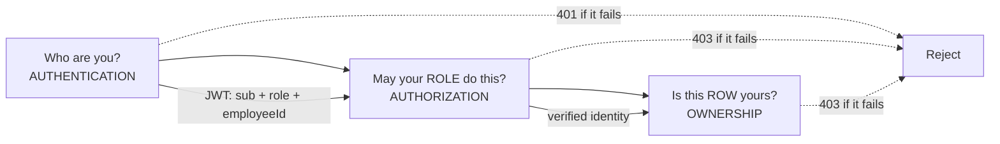
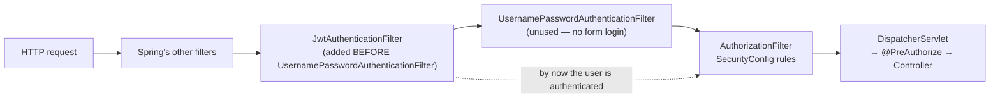
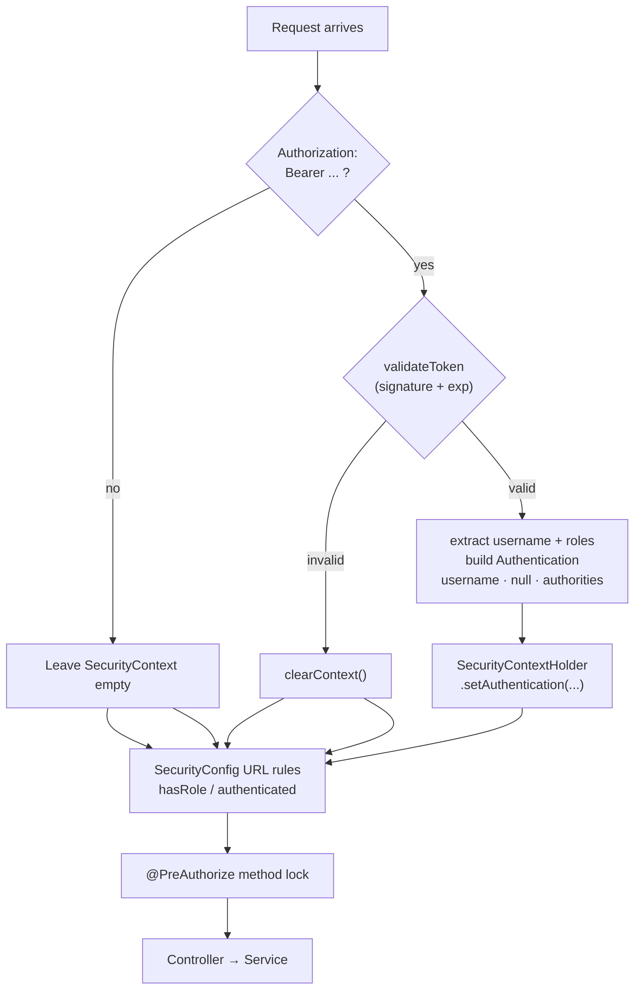
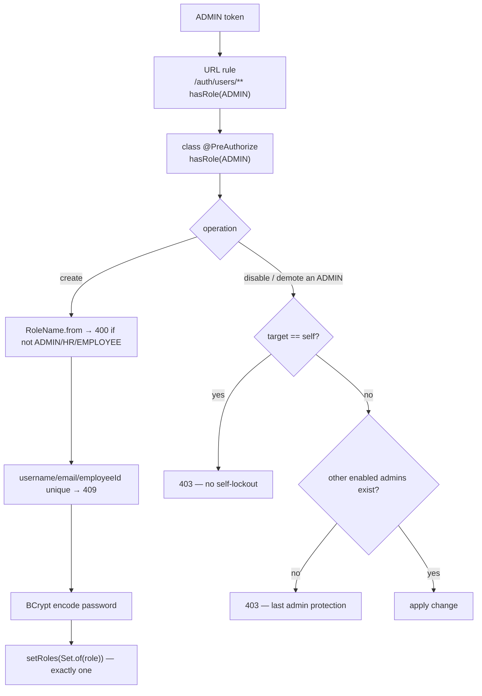
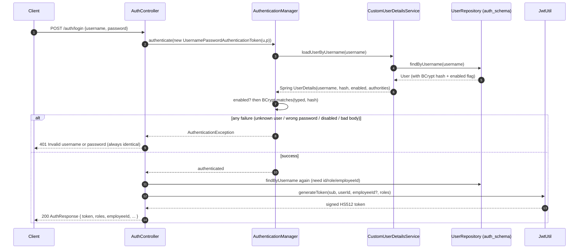
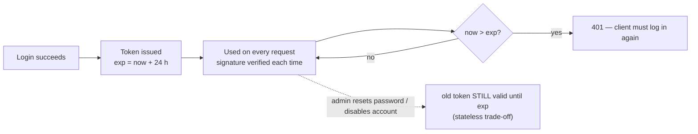
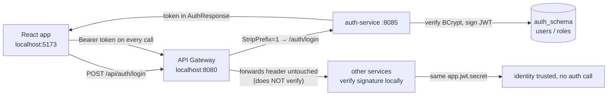
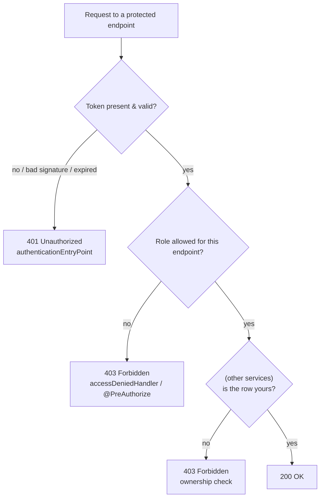
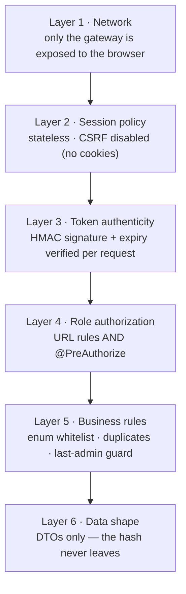

# HRMS Security — Master Notes (Merged)

> **One file. Four source docs. Beginner → Advanced.**
> This document merges, de-duplicates and re-sequences everything in:
> `SPRING_SECURITY_AND_JWT.md` · `AUTH_SERVICE_SECURITY.md` · `AUTH_SERVICE.md` · `04_SECURITY_AND_ROLES.md`.
>
> Nothing here is invented — every statement comes from one of those four files, which were in
> turn written from the current source code (`SecurityConfig`, `JwtAuthenticationFilter`, `JwtUtil`,
> `CurrentUser`, `RoleName`, and the service impls across all five services).
>
> Repetition across the four docs has been collapsed into a single authoritative explanation.
> The suggested reading order is simply **top to bottom** — each part only depends on the ones before it.

---

## How to Use This Document

| If you have… | Read |
|---|---|
| 10 minutes | [Part 12 — Cheat Sheet & One-Minute Model](#part-12--cheat-sheet--one-minute-model) |
| 1 hour | Parts 1–3, then Part 12 |
| A full study session | Everything, in order |
| An interview tomorrow | [Part 6 — Authorization Matrices](#part-6--authorization-role-gates--ownership-gates), [Part 10 — Interview Q&A](#part-10--interview-qa), [Part 11 — Beginner Mistakes](#part-11--beginner-mistakes) |

**Contents**

1. [Part 1 — Foundations: The Three Questions & the Filter Chain](#part-1--foundations-the-three-questions--the-filter-chain)
2. [Part 2 — Why It Works: Concepts Behind the Code](#part-2--why-it-works-concepts-behind-the-code)
3. [Part 3 — auth-service In Detail](#part-3--auth-service-in-detail)
4. [Part 4 — The Two Flows: Issue (login) & Verify (every request)](#part-4--the-two-flows-issue-login--verify-every-request)
5. [Part 5 — The Whole System's Trust Picture](#part-5--the-whole-systems-trust-picture)
6. [Part 6 — Authorization: Role Gates & Ownership Gates](#part-6--authorization-role-gates--ownership-gates)
7. [Part 7 — Status Codes & Error Handling](#part-7--status-codes--error-handling)
8. [Part 8 — Attack Coverage & Defense in Depth](#part-8--attack-coverage--defense-in-depth)
9. [Part 9 — Known Gaps & Hardening Recommendations](#part-9--known-gaps--hardening-recommendations)
10. [Part 10 — Interview Q&A](#part-10--interview-qa)
11. [Part 11 — Beginner Mistakes](#part-11--beginner-mistakes)
12. [Part 12 — Cheat Sheet & One-Minute Model](#part-12--cheat-sheet--one-minute-model)

---

# Part 1 — Foundations: The Three Questions & the Filter Chain

## 1.1 Security answers three questions, not two

Most people say "authentication and authorization". This project actually has **three** distinct
questions, answered in three different places:

| # | Question | Name | Where it is answered | Failure code |
|---|---|---|---|---|
| 1 | *Who are you?* | **Authentication** | `JwtAuthenticationFilter` + `CustomUserDetailsService` + BCrypt | 401 |
| 2 | *May your **role** touch this **kind** of endpoint?* | **Authorization** | `SecurityConfig` URL rules + `@PreAuthorize` | 403 |
| 3 | *Is this specific **row** yours?* | **Ownership** | Service layer, using the `employeeId` claim (other services) | 403 |

auth-service answers #1 completely and #2 for its own endpoints. #3 lives in
employee/leave/attendance/payroll, but the raw material for it — the signed `employeeId` claim —
is manufactured **here** at login.



## 1.2 The model in one picture

```
              ┌──────────────────────────────┐
              │  POST /auth/login  (public)  │
              └──────────────┬───────────────┘
                             ▼
     JWT = header.payload.signature  (HS512, shared secret)
                             │
        every request carries it:  Authorization: Bearer eyJ…
                             ▼
┌───────────────────────────────────────────────────────────┐
│ JwtAuthenticationFilter  (each service)                   │
│   signature valid? not expired? → authorities + principal │
└──────────────┬────────────────────────────────────────────┘
               ▼
┌──────────────────────────────┐   ┌──────────────────────────────────┐
│ STEP 1: ROLE AUTHORIZATION   │   │ STEP 2: RESOURCE OWNERSHIP       │
│ SecurityConfig URL rules     │ → │ ServiceImpl + CurrentUser        │
│ + @PreAuthorize              │   │ "does this ROW belong to you?"   │
│ "may your ROLE touch this    │   │ identity comes ONLY from the JWT │
│  KIND of endpoint?"          │   │ (employeeId claim)               │
└──────────────────────────────┘   └──────────────────────────────────┘
               ▼
        Controller → business logic
```

The two steps are different questions. Step 1 knows your role; Step 2 knows your row.
**Both must pass.**

## 1.3 The filter chain — WHEN does security run?

Every request passes a chain of servlet filters *before* any controller:

```
Request → JwtAuthenticationFilter (ours) → Authorization rules (SecurityConfig)
        → @PreAuthorize → Controller
```

- The filter runs **once per request** (`OncePerRequestFilter`), **before** authorization — that's
  why it is registered with
  `addFilterBefore(jwtAuthenticationFilter, UsernamePasswordAuthenticationFilter.class)`.
- Its single job: answer *"is there a valid token?"* and park the result in
  `SecurityContextHolder`. It **never rejects by itself** — it just declines to authenticate, and
  the rules decide next (401 vs 403).

### 1.3.1 Filter chain ordering (why order matters)



If the JWT filter ran *after* the authorization filter, the rules would see an empty context and
reject every request. `addFilterBefore(...)` is what guarantees the identity is known in time.

## 1.4 SecurityConfig (the same shape in all five services)

```java
http.csrf(csrf -> csrf.disable())                                  // stateless API
    .sessionManagement(s -> s.sessionCreationPolicy(STATELESS))    // no sessions, ever
    .authorizeHttpRequests(auth -> auth
        .requestMatchers("/auth/login").permitAll()                // auth-service only
        .requestMatchers("/auth/users/**").hasRole("ADMIN")
        .requestMatchers("POST", "/employees").hasRole("ADMIN")    // example
        .anyRequest().authenticated())
    .exceptionHandling(ex -> ex
        .authenticationEntryPoint(...)   // writes the 401 JSON
        .accessDeniedHandler(...))       // writes the 403 JSON
    .addFilterBefore(jwtAuthenticationFilter, …);
```

**Why the entry point / denied handler are hand-written:** security filters run **before** the MVC
layer, so `GlobalExceptionHandler` never sees these errors — and the project promises every error
body to be `{timestamp, status, error, message}`.

`hasRole("ADMIN")` looks for the authority string `"ROLE_ADMIN"` — the `ROLE_` prefix is Spring's
convention, which is why `RoleName.toAuthority()` exists.

---

# Part 2 — Why It Works: Concepts Behind the Code

## 2.1 The building blocks

### 2.1.1 Password storage — BCrypt

- **WHAT:** a password *hashing* function designed to be slow and salted.
- **WHY not SHA-256/plain?** Fast hashes are brute-forceable; BCrypt's work factor + a random salt
  per hash (`$2a$10$…`) makes cracking expensive and rainbow tables useless.
- **HOW here:** one bean (`SecurityConfig.passwordEncoder()`), used by `UserServiceImpl` on
  create/reset and by `DataSeeder`. Verification happens inside
  `AuthenticationManager.authenticate()` — **compare, never decrypt**.
- **WHERE the plain text exists:** only as a local variable in the request thread. Never logged,
  never stored, never in a JWT.

Why each property matters:

- **Slow on purpose.** The cost factor (`10` → 2¹⁰ rounds) makes each guess expensive, so
  brute-forcing a stolen hash table is impractical.
- **Random salt per hash.** Two users with the same password get *different* hashes, so
  precomputed rainbow tables are useless.
- **One-way.** You can only *verify* a login (`encoder.matches(raw, hash)`), never recover the
  original. There is no "decrypt".

```
"admin123"  ──BCrypt──►  "$2a$10$N9qo8uLOickgx2ZMRZoMye..."   (stored)
                          ▲ different every time you encode, even for the same input
```

### 2.1.2 Proof of identity across requests — JWT (stateless)

HTTP is stateless: the server forgets you between requests. Two classic answers:

- **Sessions** — server stores a session in memory/Redis; cookie points to it.
- **JWT** (this project) — the server stores *nothing*. The client holds a **signed** token that
  carries its own identity, and every service verifies the signature locally with a shared secret.

`JwtUtil` is the only class that creates or reads tokens.

```
header.payload.signature
   │       │        └─ HMAC signature over header+payload (proves it's genuine)
   │       └────────── claims: sub, userId, roles, employeeId, iat, exp  (Base64, READABLE!)
   └────────────────── {"alg":"HS512"}
```

**Signed ≠ encrypted.** Anyone can Base64-decode the payload and read it. That is why **no password
or secret is ever placed in a claim**. Changing a single character of the payload invalidates the
signature, so nobody can forge it without the secret.

**Expiration:** `exp` is checked during `parseSignedClaims`; an expired token is just an invalid
token → 401.

### 2.1.3 The claims this service issues (the contract the whole project trusts)

| Claim | Meaning | Notes |
|---|---|---|
| `sub` | username | the proven identity |
| `userId` | `users.id` in `auth_schema` | stable even if username is renamed |
| `roles` | `["ROLE_ADMIN"]` \| `["ROLE_HR"]` \| `["ROLE_EMPLOYEE"]` | **exactly one** |
| `employeeId` | linked employee record | **omitted entirely** (not `null`) for admin/HR |
| `iat` / `exp` | issued at / expires at | 24 h by default |

### 2.1.4 Reading the token on every request — the filter chain

`JwtAuthenticationFilter` runs once per request, **before** the authorization rules. It does not
*reject* anything by itself; it only decides whether to fill Spring's "who is calling?" slot
(`SecurityContextHolder`).



Key design choice: on a bad token it **continues the chain unauthenticated** rather than erroring.
This lets the one public endpoint (`/auth/login`) still work even if a stale token happens to be
attached, while protected endpoints are then refused by the rules with a clean `401`.

## 2.2 Where the caller's identity is stored — `SecurityContext`

Once verified, the filter parks a `UsernamePasswordAuthenticationToken` in `SecurityContextHolder`:

- **principal** = `AuthUser(username, employeeId)`
- **credentials** = the raw token (used by `FeignTokenRelay`)
- **authorities** = `["ROLE_ADMIN"]` etc., taken straight from the token

`SecurityContextHolder` holds an `Authentication` for the current thread:

- `getName()` → username (used by `/auth/me`);
- `getAuthorities()` → the role list (used by `@PreAuthorize` and `CurrentUser`);
- `getPrincipal()` → our `AuthUser` record (username + employeeId — used by ownership checks);
- `getCredentials()` → the raw token (used by `FeignTokenRelay`).

`AuthServiceImpl.getCurrentUser()` and `UserServiceImpl.currentUsername()` read that slot.
**Identity always comes from the token, never from the request body** — this is what makes
ownership checks trustworthy downstream.

It is cleared automatically between requests (stateless); `CurrentUser.get()` throws
`IllegalStateException` (→ 500) if the filter never ran — a misconfiguration, not a client error.

## 2.3 The role model — a closed whitelist

`RoleName` is a compile-time enum: `ADMIN`, `HR`, `EMPLOYEE` and nothing else.
`RoleName.from("SUPERUSER")` → `InvalidRoleException` → **400**, so an invented role can never
reach the database. Each account holds **exactly one** role (`setRoles(Set.of(role))` *replaces*,
never accumulates).

The short name (`ADMIN`) maps to the Spring authority (`ROLE_ADMIN`) in one place —
`RoleName.toAuthority()` — so the two spellings can never drift.

---

# Part 3 — auth-service In Detail

> Service: auth-service · Port: **8085** · Database: HRMS / `auth_schema`
> Source of truth: `auth-service/src/main/java/com/example/microservices/auth/**`

The security foundation of HRMS. It is the **only** service that issues tokens, the only one with
a public endpoint, and the only one that stores credentials.

## 3.1 What is this service?

Two things: the **login door** (verify credentials, issue a JWT) and the **account back office**
(ADMIN creates users, assigns the single role, enables/disables). It deliberately does **not** know
what an employee, leave or payslip is.

## 3.2 Why does it exist?

Authentication must happen exactly once and be trusted everywhere. Centralising it means one
password store, one role model, one token issuer — and because the other services share the
signing secret, they can verify tokens locally with **no** auth-service call per request
(stateless).

## 3.3 What does this service own?

- **Database:** `auth_schema` — `users`, `roles`, `users_roles`.
- **Entities:** `User`, `Role`, `RoleName` (enum whitelist).
- **Business responsibility:** login, `/me`, account CRUD, role assignment, enable/disable.
- **What it does NOT own:** employee data. `users.employee_id` is a plain number pointing at
  employee-service; the link is soft and is validated nowhere here.

## 3.4 Port and configuration

```properties
spring.application.name=auth-service
server.port=8085
spring.jpa.properties.hibernate.default_schema=auth_schema
app.jwt.secret=hrms-learning-demo-secret-…    # shared with all four other services
app.jwt.expiration-ms=86400000                # 24 h
```

Gateway route: `Path=/api/auth/** → lb://auth-service, StripPrefix=1`.
**No Feign, no outbound HTTP at all — it looks nobody up.**

## 3.5 Folder structure

```
auth-service/src/main/java/com/example/microservices/auth/
├── AuthServiceApplication.java
├── config/SecurityConfig.java        the access map + 401/403 JSON + BCrypt bean
├── config/DataSeeder.java            3 roles + admin/hr/employee demo accounts
├── controller/AuthController.java    POST /auth/login, GET /auth/me
├── controller/UserController.java    6 ADMIN endpoints under /auth/users
├── service/AuthService(+Impl)        login + me
├── service/UserService(+Impl)        account management rules
├── service/UserMapper.java           entity ↔ DTO + role-name mapping
├── repository/UserRepository.java, RoleRepository.java
├── entity/User.java, Role.java, RoleName.java
├── dto/LoginRequest, AuthResponse, UserResponse, CreateUserRequest,
│        UpdateUserRequest, UpdateRoleRequest, UpdateStatusRequest
├── security/JwtUtil.java             THE only token class (sign + verify)
├── security/JwtAuthenticationFilter.java
├── security/CustomUserDetailsService.java
└── exception/…  GlobalExceptionHandler + typed exceptions
```

## 3.6 Database

```
auth_schema.users
┌─────────────┬───────────────────────────────────────────────────┐
│ id          │ PK                                                │
│ username    │ UNIQUE NOT NULL                                   │
│ email       │ UNIQUE NOT NULL                                   │
│ password    │ BCrypt hash ("$2a$10$…", 60 chars) - never plain  │
│ full_name   │ optional display name                             │
│ employee_id │ UNIQUE, nullable - soft link to employee-service  │
│ enabled     │ boolean, false = cannot log in                    │
└─────────────┴───────────────────────────────────────────────────┘
auth_schema.roles          (ROLE_ADMIN, ROLE_HR, ROLE_EMPLOYEE - exactly 3 rows)
auth_schema.users_roles    (user_id, role_id - @ManyToMany join table)
```

One login per employee: `employee_id` is UNIQUE at the DB level *and* checked with a readable 409
in `UserServiceImpl`.

## 3.7 Entity — `User`

| Field | WHAT | WHY | WHO SETS IT | WHO MAY CHANGE IT |
|---|---|---|---|---|
| `id` | PK | JWT `userId` claim | DB | nobody |
| `username` | login name | JWT `sub`; unique | ADMIN | ADMIN (409 on clash) |
| `email` | contact | unique | ADMIN | ADMIN (409) |
| `password` | BCrypt **hash** | authentication | ADMIN (create/reset) | ADMIN only; never returned |
| `fullName` | display name | UI | ADMIN | ADMIN |
| `employeeId` | employee link | self-service identity | ADMIN | ADMIN; UNIQUE; nullable |
| `enabled` | on/off switch | disable without deleting | ADMIN | ADMIN; cannot disable self or last enabled admin |
| `roles` | exactly one role | authorization | ADMIN via role endpoints | ADMIN; `Set.of(role)` replaces (never accumulates) |

`setRoles` defensively copies into a **mutable** `HashSet` — handing Hibernate an immutable
`Set.of(...)` breaks collection updates.

## 3.8 DTOs (entities never leave this service — the hash must not leak)

| DTO | Direction | Fields / notes |
|---|---|---|
| `LoginRequest` | in | `username` `@NotBlank`, `password` `@NotBlank` |
| `AuthResponse` | out | `token`, `tokenType="Bearer"`, `id`, `username`, `email`, `fullName`, `roles` (e.g. `["ROLE_HR"]`), `employeeId` |
| `UserResponse` | out | like AuthResponse without token; carries `enabled` |
| `CreateUserRequest` | in | username (3–100, charset-restricted), email `@Email`, password (6–100), fullName ≤150, **role required** (ADMIN/HR/EMPLOYEE), optional employeeId |
| `UpdateUserRequest` | in | partial: only non-null fields applied; `password` = admin reset; `changeEmployeeId` flag allows un-linking |
| `UpdateRoleRequest` | in | `role` — whitelisted by `RoleName.from` (400 otherwise) |
| `UpdateStatusRequest` | in | `enabled` boolean |

## 3.9 Repository

```java
Optional<User> findByUsername(String username);                 // login + /me
boolean existsByUsername(String username); boolean existsByEmail(String email);
Optional<User> findByEmployeeId(Long employeeId);               // one-login-per-employee check
long countByRoles_NameAndEnabledTrueAndIdNot(String roleName, Long id); // last-admin guard
```

The last one reads: *"how many OTHER enabled ROLE_ADMIN users exist besides this id?"* — the SQL
for *"would anyone still be able to manage users?"*

## 3.10 Service layer

**Login — `AuthServiceImpl.login()`**

```
POST /auth/login (public)
   ↓ AuthenticationManager.authenticate(new UsernamePasswordAuthenticationToken(...))
   ↓ CustomUserDetailsService.loadUserByUsername()   → UserRepository → users row
   ↓   enabled flag checked here (disabled → DisabledException)
   ↓ BCrypt: encoder.matches(typedPassword, storedHash)
   ↓ any failure → InvalidCredentialsException → 401 "Invalid username or password"
        (SAME message for unknown user / wrong password / disabled - anti-enumeration)
   ↓ JwtUtil.generateToken(sub, userId, roles, employeeId?)   ← the token is born
   ↓ AuthResponse { token, roles, employeeId, … }
```

**Accounts — `UserServiceImpl`** (all ADMIN-only, twice-locked: URL rule + class
`@PreAuthorize`):

- create: uniqueness (409s) → `RoleName.from` whitelist (400) → BCrypt → `Set.of(role)`;
- update: per-field partial apply, duplicate re-checks, optional password re-hash;
- `setEnabled(false)`: 403 if target is yourself; 403 if last enabled admin;
- `changeRole`: same two guards before demoting an admin; replacement is `Set.of(role)`;
- `assertNotLastEnabledAdmin` counts other enabled admins — no lockout possible.

**ADMIN account-management flow with the lockout guards:**



Two independent locks on `/auth/users/**` (the URL rule **and** the class-level `@PreAuthorize`)
mean a future route accidentally mapped outside the URL pattern still cannot open account creation
to the world.

## 3.11 Controller

| METHOD PATH | PURPOSE | SUCCESS | FAILURE | AUTHORIZATION |
|---|---|---|---|---|
| `POST /auth/login` | issue JWT | 200 + AuthResponse | 401 (uniform) / 400 | **public** |
| `GET /auth/me` | who am I | 200 + UserResponse | 401 | any authenticated |
| `POST /auth/users` | create account | 201 | 400 / 409 | ADMIN |
| `GET /auth/users` | list accounts | 200 | — | ADMIN |
| `GET /auth/users/{id}` | one account | 200 | 404 | ADMIN |
| `PUT /auth/users/{id}` | update / reset password | 200 | 400 / 404 / 409 | ADMIN |
| `PATCH /auth/users/{id}/status` | enable/disable | 200 | 403 (self / last admin) | ADMIN |
| `PATCH /auth/users/{id}/role` | replace role | 200 | 400 / 403 | ADMIN |

## 3.12 Service-to-service communication

**None.** No Feign client exists in this service — auth looks nobody up. Its only connection to the
other services is the **shared JWT secret**: employee/leave/attendance/payroll verify the tokens
this service signs. (The `employeeId` claim's *target* lives in employee-service, but auth never
calls it.)

## 3.13 Frontend connection

```
Login.jsx → AuthContext.login() → authApi.login() → POST /api/auth/login
   → token persisted (localStorage.hrms_token) + user cached
axiosInstance request interceptor → Authorization header on every call
response interceptor → 401 on protected calls → wipe token → redirect /login
AuthContext on mount → GET /api/auth/me → refresh the cached profile
```

There is no register page, no `register()` API function, and no signup route — deliberately
deleted.

---

# Part 4 — The Two Flows: Issue (login) & Verify (every request)

## 4.1 The security chain, step by step (READ THIS TWICE)

```
LOGIN (issue)                                EVERY OTHER REQUEST (verify)
Browser → POST /api/auth/login               Browser → Authorization: Bearer eyJ…
  ↓ Gateway → auth-service                     ↓ Gateway forwards the header untouched
AuthController → AuthServiceImpl              JwtAuthenticationFilter (each service)
  ↓ AuthenticationManager                       ├─ header missing? → stay anonymous → 401
  ↓ CustomUserDetailsService                    ├─ JwtUtil.validateToken: signature + exp
  ↓ UserRepository (auth_schema)                ├─ roles → SimpleGrantedAuthority list
  ↓ BCrypt matches                              ├─ empty roles claim → treated as anonymous
  ↓ JwtUtil.generateToken                       └─ principal = AuthUser(username, employeeId)
  ↓ AuthResponse.token                                credentials = the raw token
localStorage.hrms_token ←──────────────        ↓ SecurityConfig URL rules (401/403)
axiosInstance interceptor adds header          ↓ @PreAuthorize (method lock)
on EVERY api call                              ↓ Controller → ServiceImpl
                                               ↓ CurrentUser → ownership check
                                               ↓ business logic → repository
```

## 4.2 Login flow (issue) — sequence



**Anti-enumeration:** unknown user, wrong password, and disabled account all produce the *same*
vague `401`. Telling them apart would let an attacker discover which usernames exist.

## 4.3 Every protected request (verify) — sequence

```mermaid
sequenceDiagram
    autonumber
    participant C as Client
    participant F as JwtAuthenticationFilter
    participant SC as SecurityContext
    participant R as SecurityConfig rules
    participant P as @PreAuthorize
    participant S as Service layer

    C->>F: GET /auth/me  (Authorization: Bearer eyJ…)
    F->>F: strip "Bearer ", validateToken(signature + exp)
    alt invalid / missing
        F->>SC: leave empty
    else valid
        F->>F: extract username + roles
        F->>SC: setAuthentication(username, null, [ROLE_…])
    end
    F->>R: continue chain
    R->>R: /auth/users/** needs hasRole(ADMIN); /auth/me needs authenticated
    alt not satisfied
        R-->>C: 401 (no identity) or 403 (wrong role)
    else satisfied
        R->>P: method lock where present (UserController)
        P->>S: identity read from SecurityContext (NOT request body)
        S-->>C: 200
    end
```

Defense in depth: an empty `roles` claim is treated as **anonymous** (a hand-made token with no
roles cannot pass an "authenticated" endpoint).

## 4.4 JWT anatomy — a real example

```
HEADER   {"alg":"HS512"}                                        → which algorithm
PAYLOAD  {"sub":"employee",
          "userId":3,
          "roles":["ROLE_EMPLOYEE"],
          "employeeId":1,                                        → absent for admin/HR
          "iat":1760000000,
          "exp":1760086400}                                      → dead after this instant
SIGNATURE  HMAC-SHA512( base64(header) + "." + base64(payload), app.jwt.secret )
```

- **Signed, not encrypted:** anyone can Base64-decode the payload (so no password inside — ever),
  but a single changed character invalidates the signature.
- **Stateless:** no session is stored; the token *is* the proof until `exp`.
- **`employeeId` claim:** the engine of every ownership check in the other services.
- jjwt picks the strongest HMAC the secret length allows (≥32 B → HS256, ≥48 → HS384, ≥64 →
  HS512). The demo secret is 75 chars → **HS512**.
- The **shared secret** (`app.jwt.secret`, identical in all five `application.properties`) is the
  entire trust model: only auth-service *issues*, everyone *verifies*. Leaking it means anyone can
  mint tokens — hence "change me in production".

## 4.5 Token lifecycle



Because the server stores no token state, **there is no revocation**: a password reset or account
disable does not kill already-issued tokens. They die only at `exp` (or when the client discards
them). Role/ownership checks still run per request, so a disabled user cannot gain new power — but
they can keep using their existing token until it expires. See Part 9.

## 4.6 Login: disabled users, and why all failures look identical

`CustomUserDetailsService.loadUserByUsername()` returns Spring's principal with the account's
`enabled` flag. A disabled account raises `DisabledException`, which `AuthServiceImpl` translates
into the **same** `401 Invalid username or password` as a wrong password — telling them apart would
confirm the username exists (user-enumeration resistance). Disabled users therefore cannot
authenticate, and in-flight tokens of a newly disabled user still work until expiry (stateless
trade-off — role/ownership checks still apply to every request).

---

# Part 5 — The Whole System's Trust Picture

## 5.1 The complete trust picture



The gateway is a dumb pipe for the token — the services verify it themselves. This is why one
shared signing secret is the entire trust model.

## 5.2 Exactly three roles, no signup

`RoleName` (auth-service) is a **compile-time whitelist**:

```java
public enum RoleName { ADMIN, HR, EMPLOYEE; }
```

- `RoleName.from("SUPERUSER")` → `InvalidRoleException` → **400** — an arbitrary role can never be
  stored.
- Every account holds **exactly one** role (`setRoles(Set.of(role))` replaces, never accumulates).
- `DataSeeder` seeds the three role rows + three demo accounts; there is **no** `/auth/register`
  endpoint, no `register()` in any frontend API file, no signup route or page. The only public
  endpoint in the whole system is `POST /auth/login`.

## 5.3 The access map (what is public and what is locked)

Only **one** endpoint in the entire system is public.

| Endpoint | Rule | Who |
|---|---|---|
| `POST /auth/login` | `permitAll()` | **anyone** (the only public door) |
| `GET /auth/me` | `authenticated()` | any logged-in role |
| `/auth/users/**` | `hasRole("ADMIN")` **+** class `@PreAuthorize` | ADMIN |
| anything else | `authenticated()` | any logged-in role |

There is **no `/auth/register`**. Public signup was removed: accounts are created by an ADMIN.
`DataSeeder` solves the bootstrap problem by seeding the first admin.

## 5.4 Why this project does it this way

| Decision | Why |
|---|---|
| JWT, stateless | any service can authenticate a request with no session store and no auth-service call |
| Shared signing secret | the services only *verify*; only auth-service *issues* |
| BCrypt, never SHA/plain | slow + salted per hash; verification only, never decryption |
| Role gates in SecurityConfig **and** `@PreAuthorize` | two independent locks — a remapped route cannot silently widen access |
| Ownership in the service layer | finer-grained than any URL pattern ("row #17 is yours") needs the data itself |
| `employeeId` claim in the token | lets every service resolve "me" without an extra auth-service call |
| Vague 401 on login failures | user-enumeration resistance |
| No gateway JWT check (current) | simpler learning topology; gateway-level verification is the documented *future* improvement |

---

# Part 6 — Authorization: Role Gates & Ownership Gates

## 6.1 The two kinds of gate, side by side

```
ROLE AUTHORIZATION (coarse)             RESOURCE OWNERSHIP (fine)
"May ROLE_EMPLOYEE call GET             "Is leave #17 really yours?"
 /leaves/{id} at all?"                  row.employeeId == JWT.employeeId?
WHERE: SecurityConfig + @PreAuthorize   WHERE: ServiceImpl + CurrentUser
FAILS → 403 (accessDeniedHandler)       FAILS → 403 (ForbiddenOperationException)
```

Both are needed. Role alone would let employee A read employee B's leave; ownership alone would have
no reason to let an employee touch leave endpoints at all.

## 6.2 ROLE authorization matrix (coarse gates, per service)

**Employee-service** (`SecurityConfig` + `@PreAuthorize`):

| Endpoint | Rule |
|---|---|
| `POST /employees` | ADMIN |
| `PUT /employees/{id}` | ADMIN |
| `DELETE /employees/{id}` | ADMIN |
| `GET /employees` | ADMIN, HR |
| `GET /employees/me` | any authenticated (service resolves own profile; ADMIN/HR → 403 no link) |
| `GET /employees/{id}` | ADMIN, HR, EMPLOYEE (service then restricts employee to own id) |

- **Leave-service:** GET = ADMIN+HR+EMPLOYEE; POST/PUT/DELETE = ADMIN+EMPLOYEE only (HR is
  read-only); then ownership + PENDING rules per row.
- **Attendance-service:** GET = all three; POST/PUT/PATCH(checkout)/DELETE = ADMIN only.
- **Payroll-service:** GET = all three; POST/PUT/DELETE/`PATCH /{id}/paid` = ADMIN only.

## 6.3 RESOURCE OWNERSHIP matrix (fine gates — identity from the JWT)

| Service | Employee may… | Rejects with |
|---|---|---|
| employee | `GET /employees/{own id}`, `GET /employees/me` | 403 `ForbiddenOperationException` otherwise |
| leave | list/read **own** rows; create with body employeeId **= JWT employeeId**; update/delete **own PENDING** rows (edit also force-overwrites employeeId) | 403 |
| attendance | list/read **own** rows; `?employeeId=` **forced** to JWT value | 403 |
| payroll | list/read **own** payslips; `?employeeId=` **forced** to JWT value | 403 |

The canonical example:

```
JWT claims:        employeeId = 10,  ROLE_EMPLOYEE
Request:           GET /employees/20
ServiceImpl:       20 != 10  →  ForbiddenOperationException  →  HTTP 403
Request:           GET /employees/10  →  200 OK
```

The id in the URL/body/query is a **request**, never **proof**. The proof is the signature on the
token. ADMIN/HR pass ownership gates freely (they are allowed to see everyone); EMPLOYEE passes
only where the row belongs to them.

## 6.4 Authorization for `/auth/users` — belt and braces

`UserController` is `@PreAuthorize("hasRole('ADMIN')")` at class level **and** `/auth/users/**` is
`hasRole("ADMIN")` in SecurityConfig — two independent locks. Inside `UserServiceImpl`:

- role whitelist via `RoleName.from` (400 otherwise);
- duplicate username/email/employeeId → **409** (`employee_id` is also UNIQUE in the table);
- you cannot disable yourself (403);
- the last enabled ADMIN cannot be demoted or disabled (403) — no lockout;
- BCrypt on every create and password-reset path; plain password exists only as a local variable.

---

# Part 7 — Status Codes & Error Handling

## 7.1 The full code table

| Code | Meaning here | Raised by |
|---|---|---|
| **401** | no token / bad signature / expired / disabled at login | `authenticationEntryPoint` in each `SecurityConfig` |
| **403** | valid identity, role or ownership refuses | `accessDeniedHandler` (URL rules), `@PreAuthorize` (via `GlobalExceptionHandler`), `ForbiddenOperationException` (ownership/lifecycle) |
| **404** | authenticated fine, row does not exist | `ResourceNotFoundException` / `NotFoundException` family |
| **409** | business conflict (duplicate, already PAID) | `EmployeeServiceException` with CONFLICT |
| **400** | malformed input / unknown role | `@Valid` + `MethodArgumentNotValidException`, `InvalidRoleException` |
| **503** | employee-service unreachable during composition | `FeignException` handler |

All bodies share one shape: `{ timestamp, status, error, message }` — the frontend's axios
interceptor and toasts read `message`.

**401 = "I don't know who you are." 403 = "I know who you are, and no."** The frontend relies on
this: a `401` triggers an auto-logout + redirect to `/login`, while a `403` is shown as "you are not
allowed" without logging the user out.

## 7.2 Decision tree — which failure code and why



## 7.3 Exception handling (auth-service)

`InvalidCredentialsException` → 401 · `InvalidTokenException` → 401 ·
`DuplicateUserException` → 409 · `UserNotFoundException` → 404 ·
`InvalidRoleException` → 400 · `OperationNotAllowedException` → 403 ·
`AccessDeniedException` → 403 · validation → 400 · 500 catch-all.
Same JSON shape everywhere.

---

# Part 8 — Attack Coverage & Defense in Depth

## 8.1 How each common attack is handled

| Attack | Mitigation in this code |
|---|---|
| **Password theft from DB** | BCrypt one-way hash + per-hash salt — stolen dump is not directly usable |
| **Token forgery** | HMAC signature with a server-only secret; one flipped payload char → `401` |
| **Token tampering (privilege escalation)** | `roles` is signed; changing `EMPLOYEE`→`ADMIN` breaks the signature |
| **User enumeration** | Unknown user / wrong password / disabled → identical vague `401` |
| **Privilege escalation via API** | Roles accepted only on ADMIN-only endpoints; `RoleName.from` whitelist (400); one role, replaced not accumulated |
| **Admin lockout** | Self-disable and last-enabled-admin demote/disable → `403` |
| **Certificate/route drift opening access** | Double lock: URL rule **and** `@PreAuthorize` |
| **Hash leakage via API** | `UserMapper` → `UserResponse`/`AuthResponse`; the entity never crosses the boundary |
| **SQL injection** | Spring Data JPA parameterised queries — no string-built SQL |
| **Malformed input** | Bean Validation (`@NotBlank`, `@Email`, `@Size`, `@Pattern`) → `400` before logic runs |

## 8.2 Defense in depth — the layers



An attacker must defeat **every** layer; a single mistake in one is caught by the next.

---

# Part 9 — Known Gaps & Hardening Recommendations

Honest observations about the current code, useful for a security review. None of these break the
learning design — they are exactly the trade-offs a real review would surface.

| # | Gap | Risk | Suggested hardening |
|---|---|---|---|
| 1 | **Signing secret is committed** in `application.properties` (`app.jwt.secret=…`) | Anyone with the repo can forge tokens | Move to an env var / secret manager; rotate; never commit real secrets |
| 2 | **DB password committed** (`spring.datasource.password=…`), despite the comment claiming otherwise | Credential leak | Env var (`${DB_PASSWORD}`) |
| 3 | **No token revocation** | Password reset / disable does not kill live tokens | Short-lived access tokens + refresh tokens, or a token version/`jti` deny-list |
| 4 | **No login rate limiting / lockout** | Online brute force | Per-IP / per-account throttle, exponential backoff, CAPTCHA |
| 5 | **Token stored in `localStorage`** (frontend) | XSS can exfiltrate it | Prefer `httpOnly` cookie or strict CSP + short expiry |
| 6 | **24 h token lifetime** | Long window for a stolen token | Shorter access token + refresh flow |
| 7 | **Weak demo passwords** (`admin123`, `hr123`) seeded | Default credentials | Force password change on first login; don't seed in production |
| 8 | **Generic `500` handler echoes `ex.getMessage()`** | May leak internals | Log the detail server-side, return a fixed message |
| 9 | **Gateway does not verify JWTs** | Token validated only per-service | Validate at the gateway too (defense in depth) |

---

# Part 10 — Interview Q&A

**From the auth-service view:**

- **Walk me through login.** Controller → AuthenticationManager → CustomUserDetailsService →
  UserRepository → BCrypt match → JwtUtil signs claims → token in AuthResponse.
- **Why BCrypt over SHA-256?** Slow by design + per-hash salt; verification-only, built for
  passwords.
- **Why JWT over sessions?** Stateless: any service verifies locally with the shared secret; no
  session store, no auth call per request.
- **How does another service trust this token?** Same `app.jwt.secret`; signature + expiry verified
  by its own filter.
- **How do you prevent privilege escalation?** Roles arrive only through ADMIN-only endpoints;
  `RoleName.from` whitelists (400); role replacement is `Set.of(role)`; self/last-admin demotions
  403.
- **Where is authorization enforced?** Three layers: SecurityConfig URL rules, `@PreAuthorize`, and
  ownership checks in service code with `CurrentUser`.
- **Why is a wrong password and an unknown username the same 401?** User-enumeration resistance.

**One-liners:**

- "Stateless JWT auth: one issuer, shared-secret verifiers, 24-hour tokens."
- "Roles in the token, ownership in the service layer, identity only from the JWT."
- "BCrypt for storage, HMAC for transport integrity."
- "401 vs 403 decides which handler answers: entry point or access-denied handler."

---

# Part 11 — Beginner Mistakes

- Returning the `User` entity (leaks the hash) instead of `UserResponse`.
- Storing plain passwords or hashing in the controller instead of the service.
- Putting a password into a JWT claim "for convenience".
- Confusing signed vs encrypted and shipping "hidden" data in the payload.
- Confusing 401 and 403 (401 = *who are you?*; 403 = *I know you, you can't*).
- Testing role rules only in the UI — the backend URL rule + `@PreAuthorize` are the real gates;
  Postman proves them.
- Expecting a disabled user's in-flight token to die immediately (stateless: it expires; role/
  ownership checks still apply per request).
- Looking up the user **from the database** in every request — unnecessary; the signature already
  proves the claims. (The project does re-read the DB on `/auth/me` for fresh profile data — that's
  a choice, not a requirement.)
- Trusting a userId from the request body/URL for authorization instead of the token.
- Disabling CSRF "because" — it's correct here only because there are no cookies.
- Forgetting that tokens of a disabled user still pass *signature* checks until expiry —
  role/ownership checks still constrain them.

---

# Part 12 — Cheat Sheet & One-Minute Model

## 12.1 Quick revision — auth-service & security

1. Three questions: **authentication (401)**, **authorization (403)**, **ownership (403)**.
2. `POST /auth/login` is the only public endpoint; there is no signup.
3. Port 8085; only service with a public endpoint; no Feign.
4. Owns `users`/`roles`/`users_roles` in `auth_schema`; BCrypt hashes only.
5. Roles: exactly ADMIN / HR / EMPLOYEE — enum whitelist, one per account.
6. JWT claims: `sub`, `userId`, `roles[1]`, `employeeId` (only if linked), `iat`, `exp` (24 h).
7. BCrypt: slow, salted, one-way — verify only, never decrypt.
8. JWT is **signed, not encrypted** → never put a secret in a claim.
9. `JwtAuthenticationFilter` fills `SecurityContext`; it does not reject.
10. `/auth/users/**` is double-locked (URL rule + class `@PreAuthorize`).
11. Roles are a closed enum; one per account; replaced, never accumulated.
12. Login failures are deliberately identical → anti-enumeration.
13. Stateless means **no revocation** — tokens live until `exp`.
14. Identity always comes from the token, never from the request body.
15. No self-lockout: self-disable and last-admin demote/disable are 403.
16. Duplicates: username/email/employeeId → 409 (`employee_id` also UNIQUE).
17. `UserMapper`/DTOs ensure the hash never leaves the service.

## 12.2 One-minute explanation (auth-service)

> Auth-service is the security core on 8085. Login is the system's only public endpoint:
> AuthenticationManager loads the account via CustomUserDetailsService, BCrypt verifies the
> password, and JwtUtil signs a 24-hour HS512 token carrying `sub`, `userId`, exactly one role, and
> `employeeId` when the account is linked to an employee. There's no signup — an ADMIN creates
> accounts through double-locked `/auth/users` endpoints, with a closed three-role enum, duplicate
> 409s, and guards against self- and last-admin lockout. Every other service shares the signing
> secret, so they verify tokens locally, and the `employeeId` claim is what powers all the
> ownership checks downstream.

## 12.3 One-minute mental model (whole system)

> auth-service is the **only** issuer of identity. Login verifies a BCrypt hash and signs a 24-hour
> HS512 token carrying `sub`, `userId`, exactly one role, and `employeeId`. Every other request is
> authenticated by re-verifying that signature in a filter, authorized by role rules in two
> independent places, and — elsewhere — checked for row ownership using the signed `employeeId`.
> Exactly three roles exist, only `/auth/login` is public, an ADMIN creates all accounts, and the
> system guards against self- and last-admin lockout. The whole trust model rests on one shared
> secret.
